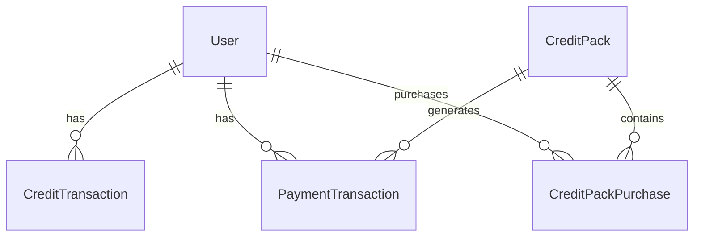

# Data Model: Credit Management System

**Feature**: `006-mettre-en-place` | **Date**: 2025-11-26  
**Status**: Complete  
**Scope**: Conceptual data model for credit packs, transactions, and user accounts

---

## Core Entities

### User Account (Extension of Existing)

Represents an individual user in the system with associated credits and permissions.

**Key Attributes:**
- `user_id` (string, primary key) - Firebase UID or equivalent
- `email` (string) - User's email address
- `display_name` (string, optional) - User's preferred display name
- `credits_balance` (integer) - Current credit balance (stored as credits × 5)
- `total_images_generated` (integer) - Lifetime count of images generated
- `total_cards_generated` (integer) - Lifetime count of cards generated  
- `total_collections_saved` (integer) - Lifetime count of collections saved
- `total_pdfs_exported` (integer) - Lifetime count of PDFs exported
- `total_c_spent` (integer) - Total credits consumed (for analytics)
- `is_admin` (boolean) - Administrator privileges
- `created_at` (datetime) - Account creation timestamp
- `last_activity_at` (datetime) - Last user activity timestamp

**Relationships:**
- Has many CreditTransactions
- Has many PaymentTransactions  
- Can purchase CreditPacks

### Credit Pack

Represents predefined credit packages available for purchase.

**Key Attributes:**
- `id` (integer, primary key) - Pack identifier
- `name` (string) - Display name (e.g., "Découverte", "Pro", "Organisme")
- `credit_amount` (integer) - Number of credits included (stored as credits × 5)
- `price_ccents` (integer) - Price in cents (e.g., 499 for €4.99)
- `is_active` (boolean) - Whether pack is currently available
- `sort_order` (integer) - Display order in UI
- `description` (text, optional) - Marketing description
- `features` (text, optional) - JSON array of included features

**Predefined Packs:**
1. **Découverte**: 25 credits, €4.99
2. **Pro**: 85 credits, €14.99  
3. **Organisme**: 250 credits, €39.99
4. **Sur-mesure**: Custom pricing (contact required)

### Credit Transaction

Represents a single credit movement in a user's account.

**Key Attributes:**
- `id` (string, primary key) - Unique transaction identifier
- `user_id` (string) - Associated user account
- `type` (enum) - 'initial_gr', 'purchase', 'consumption', 'refund', 'admin_adjust'
- `source` (string) - Operation source (e.g., 'image_generation', 'regeneration', 'context_generation', 'collection_save')
- `amount` (integer) - Credit amount (positive for additions, negative for consumption)
- `payload` (text, optional) - JSON metadata (operation details, pack reference)
- `created_at` (datetime) - Transaction timestamp

### Payment Transaction

Represents payment processing events for credit pack purchases.

**Key Attributes:**
- `id` (string, primary key) - Internal payment transaction ID
- `user_id` (string) - Associated user account
- `stripe_payment_intent_id` (string, optional) - Stripe payment intent ID
- `stripe_session_id` (string, optional) - Stripe checkout session ID
- `amount_cents` (integer) - Payment amount in cents
- `status` (enum) - 'pending', 'completed', 'failed', 'refunded'
- `created_at` (datetime) - Payment initiation timestamp
- `updated_at` (datetime) - Last status update timestamp

---

## Entity Relationships



---

## API Contracts

### User-Facing Endpoints

#### GET /api/users/me/usage
Get current user's credit balance and usage statistics.

**Response:**
```json
{
  "credits_balance": 45.2,
  "total_images_generated": 12,
  "total_cards_generated": 8,
  "total_collections_saved": 2,
  "total_pdfs_exported": 1,
  "total_credits_spent": 4.8,
  "last_activity_at": "2025-11-26T15:30:00Z"
}
```

#### POST /api/payments/purchase-pack
Purchase a credit pack.

**Request:**
```json
{
  "pack_id": 1,
  "success_url": "https://app.fresquia.com/billing/success",
  "cancel_url": "https://app.fresquia.com/billing/cancel"
}
```

**Response:**
```json
{
  "checkout_url": "https://checkout.stripe.com/pay/...",
  "payment_intent_id": "pi_..."
}
```

#### POST /api/payments/webhook
Handle Stripe webhook events for payment completion.

**Request:** (Stripe webhook format)
```json
{
  "type": "payment_intent.succeeded",
  "data": {
    "object": {
      "id": "pi_...",
      "metadata": {
        "user_id": "firebase_uid_123",
        "pack_id": "1"
      }
    }
  }
}
```

### Admin Endpoints

#### GET /api/admin/users/{userId}
Get detailed user information for admin management.

**Response:**
```json
{
  "user_id": "firebase_uid_123",
  "email": "user@example.com",
  "display_name": "John Doe",
  "credits_balance": 45.2,
  "total_images_generated": 12,
  "total_cards_generated": 8,
  "total_collections_saved": 2,
  "total_pdfs_exported": 1,
  "total_credits_spent": 4.8,
  "is_admin": false,
  "created_at": "2025-11-01T10:00:00Z",
  "last_activity_at": "2025-11-26T15:30:00Z"
}
```

#### GET /api/admin/users/{userId}/transactions
Get paginated credit transaction history for a user.

**Query Parameters:**
- `limit` (integer, default 20) - Number of transactions per page
- `offset` (integer, default 0) - Page offset
- `type` (string, optional) - Filter by transaction type

**Response:**
```json
{
  "transactions": [
    {
      "id": "txn_123",
      "type": "purchase",
      "source": "stripe",
      "amount": 125,
      "payload": {
        "pack_name": "Pro",
        "pack_credits": 85
      },
      "created_at": "2025-11-26T15:30:00Z"
    },
    {
      "id": "txn_124", 
      "type": "consumption",
      "source": "image_generation",
      "amount": -5,
      "payload": {
        "image_count": 40
      },
      "created_at": "2025-11-26T14:15:00Z"
    }
  ],
  "total": 2,
  "has_more": false
}
```

#### POST /api/admin/users/{userId}/credits/adjust
Manual credit adjustment by administrator.

**Request:**
```json
{
  "amount": 50,
  "reason": "Customer service credit",
  "source": "admin_adjust"
}
```

**Response:**
```json
{
  "credits_balance": 95.2,
  "transaction_id": "txn_125"
}
```

---

## Credit Consumption Rules

### Operations and Credit Costs

| Operation | Credit Cost | Formula | Notes |
|-----------|-------------|---------|-------|
| Image Generation | 1 credit per 8 images | `ceil(imageCount / 8)` | Batch operation |
| Image Regeneration | 0.2 credit | `imageCount × 0.2` | Individual images |
| Context Generation | 1 credit | `1` | Per context |
| Collection Saving | 10 credits | `10` | Fixed cost |
| PDF Export | FREE | `0` | No cost |
| PNG Export | FREE | `0` | No cost |

### Credit Precision

All credit calculations use **integer storage** (credits × 5) to avoid floating-point precision:

| Display Credits | Storage Integer | Operation |
|-----------------|------------------|----------|
| 0.2 | 1 | Image regeneration |
| 1.0 | 5 | Image generation (8 images), Context generation |
| 10.0 | 50 | Collection saving |
| 25.0 | 125 | Découverte pack |
| 85.0 | 425 | Pro pack |
| 250.0 | 1250 | Organisme pack |

---

## Error Handling

### Standardized Error Responses

#### Insufficient Credits
```json
{
  "error": "Not enough credits",
  "code": "INSUFFICIENT_CREDITS",
  "message": "You need 5 more credits to complete this operation",
  "details": {
    "required": 5,
    "available": 2.4,
    "operation": "image_generation",
    "suggestion": "Purchase more credits to continue"
  }
}
```

#### Invalid Pack
```json
{
  "error": "Invalid credit pack",
  "code": "INVALID_PACK", 
  "message": "The requested credit pack is not available"
}
```

#### Payment Required
```json
{
  "error": "Payment required",
  "code": "PAYMENT_REQUIRED",
  "message": "Purchase credits to access this feature",
  "details": {
    "available_packs": [
      {
        "id": 1,
        "name": "Découverte",
        "credits": 25,
        "price": "€4.99",
        "price_per_credit": "€0.20"
      },
      {
        "id": 2,
        "name": "Pro", 
        "credits": 85,
        "price": "€14.99",
        "price_per_credit": "€0.18"
      }
    ]
  }
}
```

---

## Testing Strategy

### Unit Tests
- Credit calculation precision (multiply by 5)
- Transaction atomicity under concurrent operations
- Admin permission checks
- Payment webhook signature verification

### Integration Tests  
- End-to-end credit pack purchase flow
- Credit consumption for each operation type
- Admin user management operations
- Error scenarios (insufficient credits, payment failures)

### Quickstart Validation Steps
1. **Setup Test Environment**
   - Create test user with 50 free credits
   - Configure Stripe test keys
   - Verify admin permissions

2. **Credit Balance Operations**
   - Check initial balance: GET /api/users/me/usage
   - Consume credits: Generate images (8 images = 1 credit)
   - Verify balance deduction
   - Regonsume credits: Regenerate image (0.2 credit)
   - Generate context: 1 credit
   - Save collection: 10 credits

3. **Purchase Flow**
   - Initiate pack purchase: POST /api/payments/purchase-pack
   - Complete Stripe checkout
   - Verify webhook processing: POST /api/payments/webhook
   - Confirm credit addition

4. **Admin Operations**
   - View user details: GET /api/admin/users/{userId}
   - View transaction history: GET /api/admin/users/{userId}/transactions
   - Manual credit adjustment: POST /api/admin/users/{userId}/credits/adjust

---

## Implementation Tasks

This data model and contract design enables the following implementation approach:

### Phase 1: Database & Core Services
1. **Database Schema Migration** - Extend users table, create credit_packs, credit_transactions, payment_transactions tables
2. **Credit Service** - Implement credit calculation, transaction logic, and enforcement
3. **Payment Service** - Stripe integration, webhook handling, error management

### Phase 2: API Endpoints
1. **User Usage Endpoint** - GET /api/users/me/usage
2. **Payment Endpoints** - Purchase initiation, webhook handling
3. **Admin Endpoints** - User management, transaction history, credit adjustment

### Phase 3: Frontend Integration
1. **Credit Balance Display** - Show current credits prominently
2. **Purchase Flow** - Credit pack selection, Stripe Checkout integration
3. **Admin Interface** - User management dashboard
4. **Error Handling** - Insufficient credits messaging

---

**Status**: ✅ Data model complete with all entities, relationships, and contracts defined  
**Next**: Execute `/tasks` to generate implementation tasks based on this design